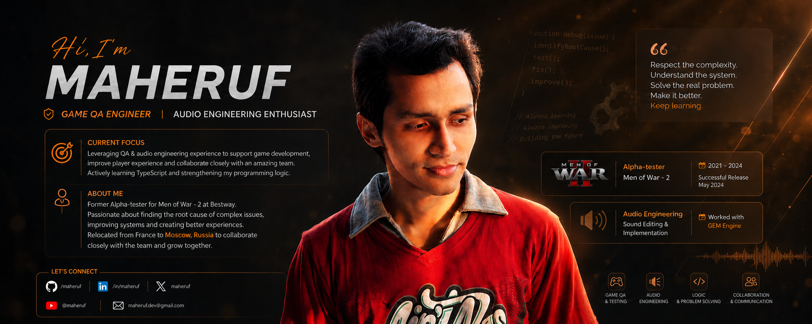
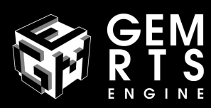

  

<h1 align="center">Hi 👋, I'm Max Maheruf</h1>

  

  Welcome to my GitHub! I am focused on building clean, efficient, and user-friendly web applications, with a strong interest in networking and local AI models. Let's code, design, innovate, and solve.

  🌱 Currently exploring: TypeScript React.js

---

### 👨‍💻 About Me

- 🔭 I’m currently focusing my studies on web development using **JavaScript** and **TypeScript**.
- ⚙️ I enjoy configuring and optimizing network hardware, such as setting up multi-WAN load balancing and failover on **OpenWrt** single-board computers.
- 🤖 I spend time exploring and running local large language models (using tools like **llamafile**) on custom hardware setups.
- 🎯 Long-term goal: becoming a confident **Full Time Game-Developer**
- 🎮 I have experience as an **Alpha Tester** for **Men of War II** by [Best Way](https://bestway.com.ua/games/), where I provided direct feedback on UI/UX improvements, gameplay testing, bug fixing and also sound engineering.
- 🛠️ I actively develop **Steam community mods** for GEM engine titles, including *Men of War II* and *Call to Arms* by DigitalMindsoft.
- 📝 I use **Notion** and **Discord** to document and share my programming revision notes.
- 📬 Reach me at **maheruf.dev@gmail.com**

---

### 🛠️ Tech Stack & Tools

**Languages & Frameworks:**

  
  
  

**Tools & Environments:**

  
  
  
  

**Game Development:**

  

---

### 📊 GitHub Stats

  

<!-- 

  
   
  

  

 -->

---

# 📈 Contribution Activity

  

---

### 📫 Connect with Me

  
  
  
  

